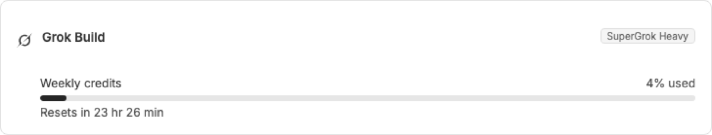
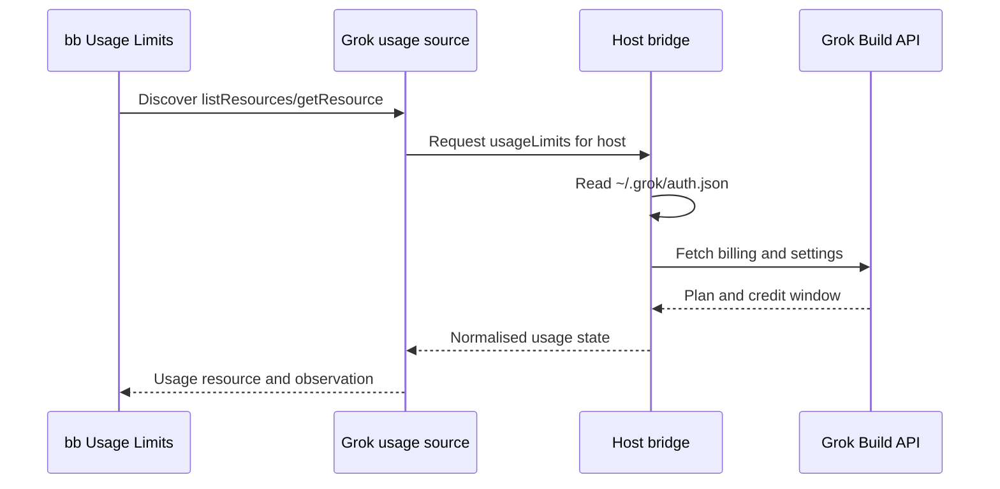

<div align="center">


# Grok Build Usage

### See your Grok Build credits in bb.

Track Grok Build plans, credit windows and reset times beside your other bb provider usage.<br>
Sign-in and expired-session states stay visible instead of becoming silent failures.


[Features](#features) · [Install](#install) · [Where to find it](#where-to-find-it) · [How it works](#how-it-works) · [Privacy](#privacy) · [Development](#development)

<br>



</div>

<br>

> [!NOTE]
> The screenshot is a real BB capture populated with fictional demo data.

## The problem

When you use Grok Build through bb, its execution provider can work while its
subscription usage is missing from bb's Usage Limits view. You have to switch
to another tool to check credits, and an expired login can look like a generic
collection failure.

This plugin adds a discoverable usage source for Grok Build. You get the plan,
credit window, usage percentage and reset time in the same place as your other
providers, with actionable sign-in guidance when needed.

|  | Without Grok Build Usage | With Grok Build Usage |
| --- | :---: | :---: |
| Grok Build appears in Usage Limits | ❌ | ✅ Host usage card |
| Credit window and reset time | ❌ | ✅ Live billing data |
| Expired or signed-out guidance | ❌ | ✅ bb status message |

## Features

<table>
<tr>
<td width="50%" valign="top">

### 📊 Live credit windows

See the active weekly or monthly credit window, percentage used and reset time.

</td>
<td width="50%" valign="top">

### 🧾 Plan details

Show the current Grok Build plan label when the settings endpoint provides it.

</td>
</tr>
<tr>
<td valign="top">

### 🔐 Useful status states

Not-installed, signed-out, expired and billing-error states remain distinguishable.

</td>
<td valign="top">

### 🖥️ Host-aware resources

Usage is listed per connected host that owns the Grok Build provider.

</td>
</tr>
</table>

## Install

```sh
bb plugin install git:https://github.com/MacHatter1/bb-plugin-grok-build-usage --yes
```

Install Grok Build on the host, run `grok login`, then open bb's Usage Limits page.

<details>
<summary><b>Install from a local clone</b></summary>

```sh
git clone https://github.com/MacHatter1/bb-plugin-grok-build-usage
cd bb-plugin-grok-build-usage
npm install && bb plugin build
bb plugin install path:$PWD --yes
```

</details>

**Requirements**

- bb **0.44+** (Plugin SDK 0.5.29+)
- Grok Build installed with the `grok` command available on `PATH`
- An authenticated session created with `grok login`

## Where to find it

| Where | What |
| --- | --- |
| **Settings → Usage Limits** | View Grok Build plan, credit usage, reset time and status guidance. |

## How it works



- **Discovery.** The server registers a `provider-usage.v1` source so bb can list
  one stable resource for each host that owns the provider.
- **Host collection.** The host bridge reads the local Grok credential and
  fetches billing data directly from Grok's endpoints.
- **Normalisation.** Weekly and legacy monthly responses are converted into bb's
  usage-window shape, with status states preserved.
- **Caching.** Successful observations are kept in memory for up to 60 seconds;
  bb can request a fresh collection.

## Privacy

- 🔒 **Credentials stay local.** The plugin reads `~/.grok/auth.json` on the
  host and does not expose the token through the usage resource.
- 🌐 **Network access is limited.** The host contacts Grok's billing and settings
  endpoints only when collecting usage.
- 🧹 **No persistent usage store.** Normalised observations are cached in memory
  and are discarded when the plugin reloads.

## Development

```sh
npm install
npm test
npx tsc --noEmit
bb plugin build
bb plugin install path:$PWD --yes
bb plugin dev
```

```text
src/server.ts       provider registration and discoverable usage source
src/host.ts         ACP and maintenance bridge
src/grok-usage.ts   credential, health and billing parsing
src/usage-source.ts provider-usage.v1 resource and observation handlers
tests/              parser and usage-source contract tests
docs/               logo and usage screenshot
```

**Tests** cover credential and billing parsing, subscription labels, provider
registration, resource discovery, usage-window normalisation, non-OK states and
resource validation using a fake plugin host.

`PLUGIN_OVERVIEW.md` is the store listing. Keep it in step with `bb.description`
in `package.json`.

## Licence

[MIT](LICENSE)
