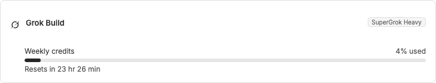

# Grok Build Usage for bb

This bb plugin adds live Grok Build subscription and usage information to
**Settings → Usage Limits**.



It registers a companion provider because bb's built-in ACP provider already
owns the `acp-grok` id. The companion keeps the existing Grok Build execution
provider intact while adding the maintenance bridge needed for usage data.

## Features

- Shows the current Grok Build subscription, such as `SuperGrok Heavy`.
- Reports the active credit window, percentage used, and reset time.
- Supports the current weekly credit response and the legacy monthly counter
  response.
- Reuses bb's normal provider health, sign-in, and expired-session states.
- Uses the Grok icon in the provider and usage-limit surfaces.

## Requirements

- bb `>=0.40`.
- Grok Build installed with the `grok` command available on `PATH`.
- An authenticated Grok Build session created with:

  ```sh
  grok login
  ```

If Grok Build is not installed or signed in, bb shows the normal provider
status and sign-in guidance.

## Install

Install from a local checkout while developing:

```sh
bb plugin install /path/to/bb-plugin-grok-build-usage --yes
```

Once this repository is published, the marketplace submission should provide
the canonical Git URL. A Git-based install will then look like:

```sh
bb plugin install git:https://github.com/MacHatter1/bb-plugin-grok-build-usage.git@main
```

This assumes the repository is published as
`MacHatter1/bb-plugin-grok-build-usage`. Update the URL if the final
marketplace repository uses a different owner or name.

## Development

```sh
npm install
npm test
npx tsc --noEmit
bb plugin build
bb plugin install . --yes
```

`bb plugin build` writes the generated bundle to `dist/`. The generated bundle
and installed dependencies are ignored by Git.

## Repository layout

```text
.
├── assets/icons/grok.svg   # Provider branding
├── src/
│   ├── grok-usage.ts       # Auth, health, subscription, and usage logic
│   ├── host.ts             # ACP and maintenance bridge
│   └── server.ts           # Provider registration and metadata
├── tests/
│   └── grok-usage.test.ts  # Pure usage and subscription parsing tests
├── package.json
├── package-lock.json
└── tsconfig.json
```

## How it works

The host bridge reads the Grok CLI credential from `~/.grok/auth.json` and
keeps it in memory for authenticated requests. It fetches usage from Grok
Build's billing endpoint and supplements the response with the current
subscription label from the settings endpoint. The billing implementation is
based on the endpoint flow used by [xAI's Grok Build billing extension](https://github.com/xai-org/grok-build/blob/main/crates/codegen/xai-grok-shell/src/extensions/billing.rs).

The plugin does not replace bb's built-in `acp-grok` provider. Its
`grok-build-usage` companion id owns the additional maintenance requests while
delegating ACP traffic to bb's existing bridge.

## Privacy and security

- The plugin reads `~/.grok/auth.json` but never modifies it.
- Credentials are sent only to the configured Grok Build endpoints and are not
  logged or persisted by the plugin.
- Authentication is performed with the session created by `grok login`.
- Do not commit `auth.json`, generated bundles, or local logs.

Grok Build usage is subject to xAI's account and product policies. The plugin
is an independent community integration and is not affiliated with xAI or bb.

## Limitations

The integration depends on the Grok CLI's local credential format and its
authenticated billing and settings endpoints. Those interfaces may change
without notice. If a request fails, bb reports the provider's health or usage
error so the failure remains visible instead of being presented as valid usage.
